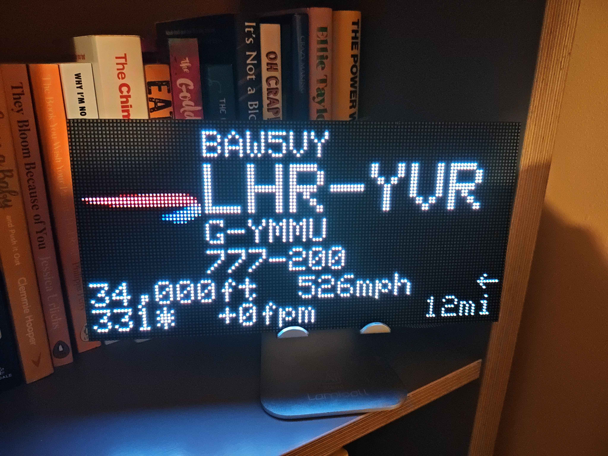
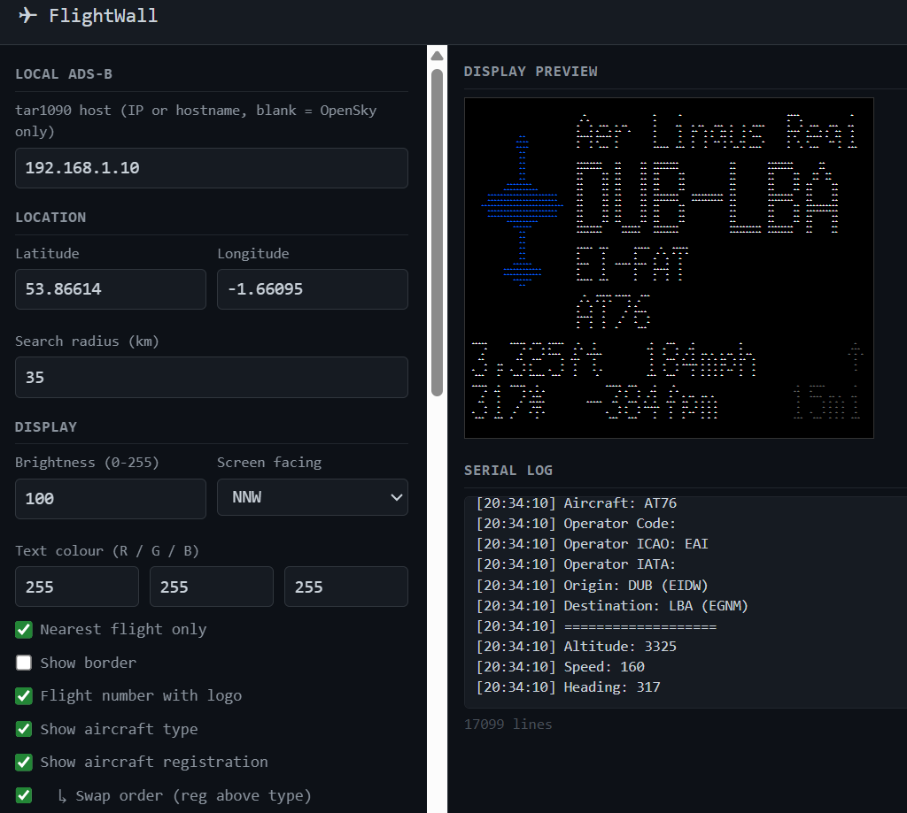
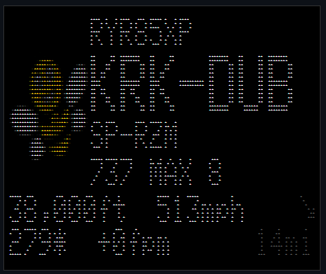
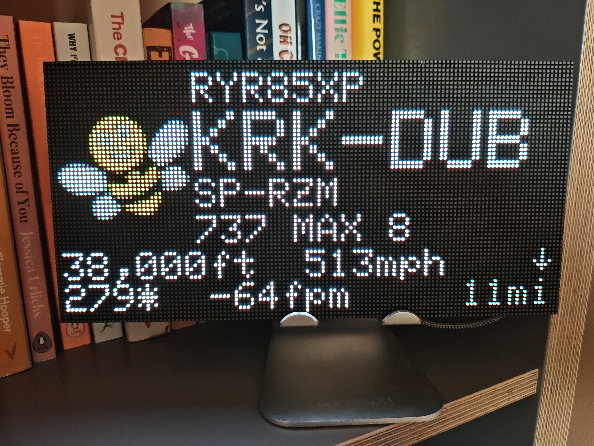

# TheFlightWall 

TheFlightWall is an LED wall which shows live information of flights going by your window.



This fork has two primary purposes:
1) Change the interface to a HUB75 screen
2) Use local data from an ADSB receiver (running tar1090)

It also adds a working logo lookup (locally stored on the ESP32) as well as a WebUI for some basic settings and display preview.

It retains the links to OpenSky Network (Free API) and AeroAPI (Paid API) but both are optional.
It introduces hexdb.io lookups to try and replace AeroAPI calls where possible.

This has shamelessly been put together with the help of a free trial of Claude Code... 
It likely could do with lots of refinement, especially around more efficient API calls - be warned if using the paid AeroAPI calls.

The original project has an official product available:

**Don't feel like building one? Check out the official product: [theflightwall.com](https://theflightwall.com)**

## Hardware and Firmware

- Screen: Designed for a P2 128x64 HUB75 display ([Aliexpress P2 example](https://www.aliexpress.com/item/1005001958308355.html)- P2.5 and P3 sizes also available)
- ESP32: [ESP32-Trinity](https://esp32trinity.com/), a plugin module for HUB75 screens

The ESP-Trinity is a well packaged module which plugs into a HUB75 screen and can also power the screen when used with a suitable USB-C power supply. 
You can also use a standard ESP32 module and wire it accordingly.

Firmware built with PlatformIO / Arduino framework, targeting the `wemos_d1_mini32` board profile (any ESP32 dev board works).


## Data and Software

### Data API Keys

The data for this project consists of two main data sources:
1. Core public [ADS-B](https://en.wikipedia.org/wiki/Automatic_Dependent_Surveillance%E2%80%93Broadcast) data for flight positions and callsigns - using [OpenSky](https://opensky-network.org) 
2. Flight information lookup - aircraft, airline, and route (origin/destination airport). This is typically the hardest / most expensive information to find. Using [FlightAware AeroAPI](https://flightaware.com/aeroapi) (PAID) and [hexdb.io](https://opensky-network.org) (FREE)

### Setting up OpenSky
1. Register for an [OpenSky](https://opensky-network.org/) account
2. Go to your [account page](https://opensky-network.org/my-opensky/account)
3. Create a new API client and copy the `client_id` and `client_secret` to the [APIConfiguration.h](firmware/config/APIConfiguration.h.example) file

### Setting up AeroAPI
1. Go to the [FlightAware AeroAPI](https://flightaware.com/aeroapi) page and create a personal account
2. From the dashboard, open **API Keys**, click **Create API Key** and follow the steps
3. Copy the generated key and add it to [APIConfiguration.h](firmware/config/APIConfiguration.h.example)

## Software Setup

### Set your WiFi

On first boot, the ESP32 will broadcast an AP and you can configure it from there.
Alternatively, enter your WiFi credentials into `WIFI_SSID` and `WIFI_PASSWORD` in [WifiConfiguration.h](firmware/config/WifiConfiguration.h)

### Set your location

On first boot, the ESP32 will broadcast an AP and you can configure it from there.
Alternatively, set your location to track flights by updating the following values in [UserConfiguration.h](firmware/config/UserConfiguration.h.example):

- `CENTER_LAT`: Latitude of the center point to track (e.g., your home or city)
- `CENTER_LON`: Longitude of the center point
- `RADIUS_KM`: Search radius in kilometers for flights to include

### Logo Creation

Logos are stored on the ESP32's own flash (LittleFS) as pre-dithered 32 × 32 px RGB565 bitmaps, one file per airline ICAO code. Flights without a matching logo fall back to a generic aircraft icon. See `firmware/adapters/LocalLogoStore` for the file format.

A python script is provided in `tools/build_logos_local.py`.

It requires a source of airline logos - I recommend [Jxck-S's](https://github.com/Jxck-S/airline-logos) repository - specifically the FlightAware logos.

## Architecture

```
main.cpp
  ├─ FallbackStateVectorFetcher    primary: Tar1090Fetcher ➜  fallback: OpenSkyFetcher
  ├─ FlightDataFetcher             enriches state vectors with AeroAPI + CDN metadata
  ├─ NeoMatrixDisplay              renders flight cards on the HUB75 panel
  └─ WebConfig                     HTTP config + serial-log UI served on port 80
```

### Data flow (each fetch cycle)

1. `FallbackStateVectorFetcher` fetches nearby aircraft positions – local ADS-B first, OpenSky if unavailable.
2. `FlightDataFetcher` enriches each callsign: AeroAPI for route/airline/aircraft, FlightWall CDN for human-readable names, `LocalLogoStore` for the airline logo bitmap.  Results are cached in RAM (default 30 min) to minimize API calls.
3. `NeoMatrixDisplay` cycles through the enriched `FlightInfo` list, rendering one card per `display_cycle_seconds`.

---

### Config files

| File | Purpose |
|---|---|
| `config/UserConfiguration.h` | Location, radius, display defaults |
| `config/APIConfiguration.h` | API credentials and endpoints (OpenSky, AeroAPI, tar1090 host) |
| `config/TimingConfiguration.h` | Fetch intervals, timeouts, cache TTLs |
| `config/HardwareConfiguration.h` | Panel resolution and tile layout |
| `config/WifiConfiguration.h` | Compile-time WiFi credentials (optional – captive portal available) |
| `config/RuntimeConfig.h/.cpp` | Mutable copy of all settings, backed by NVS (Preferences). All runtime changes go here. |

All settings in the header files serve as **compile-time defaults**. On first boot `loadConfig()` writes them to NVS. After that the web UI can override any value and `saveConfig()` persists it – no reflash needed.

### Key components

#### Adapters (data in)
- **`Tar1090Fetcher`** – HTTP GET `/tar1090/data/aircraft.json` from a local ADS-B receiver; parses position, registration (`r`), and aircraft type (`t`). Returns `false` when the host is not configured, triggering fallback.
- **`OpenSkyFetcher`** – OAuth2 token fetch + `states/all` query filtered to a bounding box; parses the state vector array.
- **`FallbackStateVectorFetcher`** – Wraps primary + secondary fetcher; tracks which source was used last cycle so `main.cpp` can apply the appropriate fetch interval.
- **`AeroAPIFetcher`** – HTTPS GET `/flights/{ident}`; returns route, operator codes, aircraft type, and registration.
- **`FlightWallFetcher`** – HTTPS GET of small JSON blobs from the FlightWall CDN: airline display names, aircraft type display names, airport IATA codes. Called once per new callsign, then cached.
- **`LocalLogoStore`** – Loads pre-dithered 32×32 RGB565 bitmaps from LittleFS. One `.bin` file per airline ICAO code. No network call.

#### Core
- **`FlightDataFetcher`** – Orchestrates the full enrichment pipeline. Manages the in-RAM cache, applies live telemetry from the current state vector (altitude, speed, heading, vertical rate, distance, bearing), and fills registration/type from the local ADS-B source when AeroAPI doesn't provide them.

#### Display
- **`NeoMatrixDisplay`** – HUB75 matrix via `ESP32-HUB75-MatrixPanel-I2S-DMA`. Renders a 128×64 flight card with a 32×32 logo column on the left and five text lines on the right. On data refresh, only the two telemetry lines (altitude/speed and heading/vspeed/distance) are repainted in-place – the logo and route block are only cleared on a natural cycle advance, eliminating visible flicker.

#### Utils
- **`WebConfig`** – Single-file HTTP server (no external web framework). Serves the config/log UI, handles `GET /api/config` and `POST /api/config`, streams the serial log via `GET /api/log`.
- **`WifiProvisioner`** – Captive-portal AP for first-boot WiFi setup. Saves credentials to NVS.
- **`TelnetLogger`** – `Log.print/printf` wrapper; output appears on the serial monitor and in the web UI log pane simultaneously.

---

## Web UI

The Web Interface allows a variety of options to be set, shows an approximation of what is currently on display and prints a serial output.



### Options:
 - Local ADSB: set this to your tar1090 server
 - Location: Set your Lat/Lon
 - Search Radius
 - Brightness
 - Screen Orientation: Setting this calibrates the aircraft direction arrow
 - Text Colour
 - Nearest Flight Only: Setting this will show only the nearest flight instead of cycling those within range
 - Show Border: (Yes... if you check the photos I broke a single LED off my frame)
 - Flight Number with Logo: If a logo is available, the airline name is replaced by the flight number
 - Show Aircraft Type
 - Show Aircraft Registration
 - Swap Order: Show Registration above Type
 - Flip display 180° 
 - Enable Night Dimming: When brightness set to 0, no API calls are made
 - Fetch Interval Local: Tar1090 updates can update the current flight details (Speed, heading etc)
 - Fetch Interval OpenSky
 - Display Cycle: How long to show a flight on screen (when showing all in range)
 - Cache timeouts
 - API keys

### ASCII Preview


---

## Build and flash with PlatformIO

The firmware can be built and uploaded to the ESP32 using [PlatformIO](https://platformio.org/)

1. **Install PlatformIO**: 
   - Install [VS Code](https://code.visualstudio.com/)
   - Add the [PlatformIO IDE extension](https://platformio.org/install/ide?install=vscode)

2. **Configure your settings**:
   - Copy `firmware/config/APIConfiguration.h.example` to `firmware/config/APIConfiguration.h` and add your API keys
   - Copy `firmware/config/UserConfiguration.h.example` to `firmware/config/UserConfiguration.h` and set your location
   - Adjust display hardware (pins, tile layout) in [HardwareConfiguration.h](firmware/config/HardwareConfiguration.h)

3. **Build and upload**:
   - Open the `firmware` folder in PlatformIO
   - Connect your ESP32 via USB
   - Click the "Upload" button (➜) in the PlatformIO toolbar under esp32dev
   - Click "Build Filesystem Image" in the Platform submenu
   - Click "Upload Filesystem Image" in the Platform submenu
